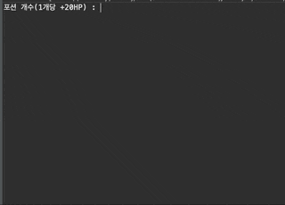

# 다향성 좀비 콘솔 게임

> ### 소개
>

#### 히어로가 되어 몬스터들을 죽이고 별을 획득하면 승리하는 게임 

---

* 플레이 방법
  
  * 게임 진행 중 사용할 포션의 갯수를 입력한다. (각 포션 +20HP)
    
  * 게임이 시작되고 자신이 원하는 행동을 선택한다.
    * 1 - 앞으로 이동하기
      
    * 2 - 뒤로 이동하기
   
    * 3 - 포션 마시기
   
    * 4 - 게임 종료

  * 몬스터를 만나면 전투모드로 전환된다
    * 1 - 공격하기  2 - 포션 마시기

    
---

> ### Class Digran(UML)  

---

> ### Demo  

